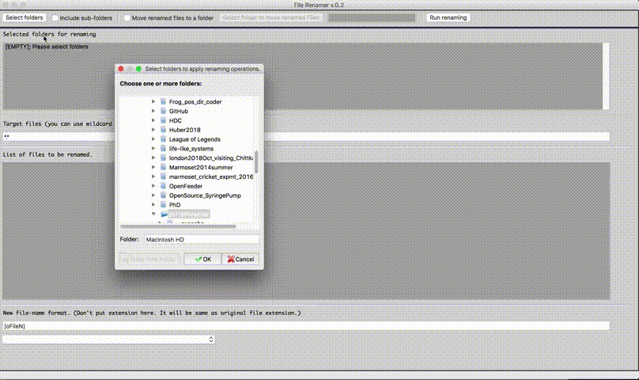

# pyFileRenamer

Utility program in Python to rename a batch of files.

Jinook Oh, Cognitive Biology department, University of Vienna 
Contact: jinook0707@gmail.com, tecumseh.fitch@univie.ac.at 
September 2019.

## Dependency:
- **Python** (3.7)
- **wxPython** (4.0)
